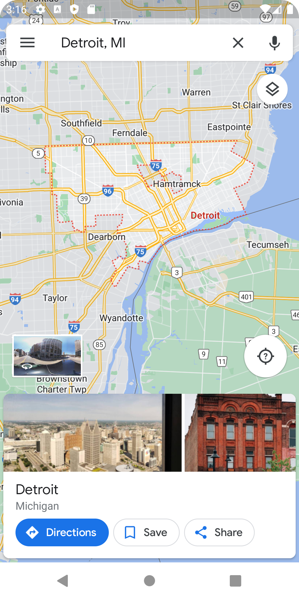
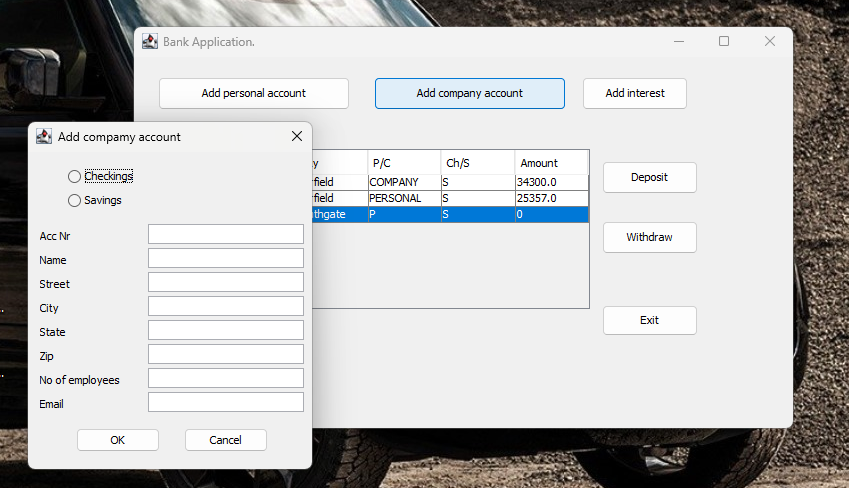

    
    <h2 align="center">Android development - Kotlin</h2>
    

<h2>Resume Builder Application:My CV - <a href="https://github.com/nq-masuku/CVBuilderApplication">Project Link</a></h2>

<table border="0">
    <tr>
        
        Explanation
        
    </tr>
</table>

<table border="0">
      <tr>
        <td></td>
        <td></td>
        <td></td>
        <td></td>
        <td></td>
    </tr>
    <tr>
        <td></td>
        <td></td>
        <td></td>
        <td></td>
        <td></td>
    </tr>
      <tr>
        <td></td>
        <td></td>
        <td></td>
        <td></td>
        <td></td>
    </tr>
     <tr>
        <td></td>
        <td></td>
    </tr>
</table>

 

<h2>Quiz Application - <a href="https://github.com/nq-masuku/QuizAndroidApplication">Project Link</a></h2>

<table border="0">
    <tr>
        
        Explanation
        
    </tr>
</table>

<table border="0">
      <tr>
        <td></td>
        <td></td>
        <td></td>
        <td></td>
        <td></td>
    </tr>
    <tr>
        <td></td>
        <td></td>
        <td></td>
        <td></td>
        <td></td>
    </tr>
     <tr>
        <td></td>
        <td></td>
        <td></td>
        <td></td>
        <td></td>
    </tr>  
    <tr>
        <td></td>
        <td></td>
        <td></td>
        <td></td>
        <td></td>
    </tr>
        <tr>
        <td></td>
        <td></td>
    </tr>
   </table>

 
 

<h2>Banking application - <a href="https://github.com/nq-masuku/banking-application">Project Link</a></h2>

<table border="0">
    <tr>
        
        Explanation
        
    </tr>
</table>

<table border="0">
      <tr>
        <td></td>
        <td></td>
        <td></td>
    </tr>
    <tr>
        <td></td>
        <td></td>
        <td></td>
    </tr>
    <tr>
        <td colspan="3"> Architecture diagram</td>
    </tr>
    <tr>
        <td colspan="3"></td>
    </tr>
   </table>

